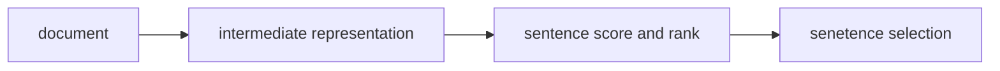
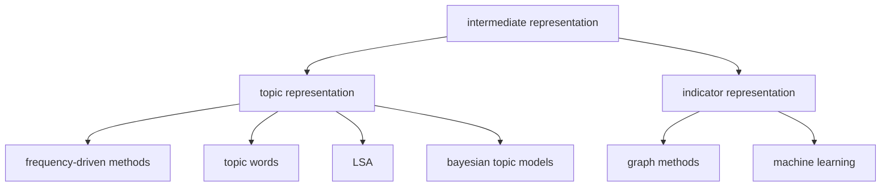
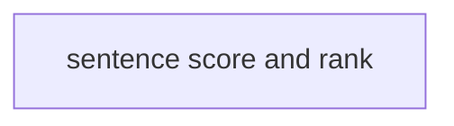
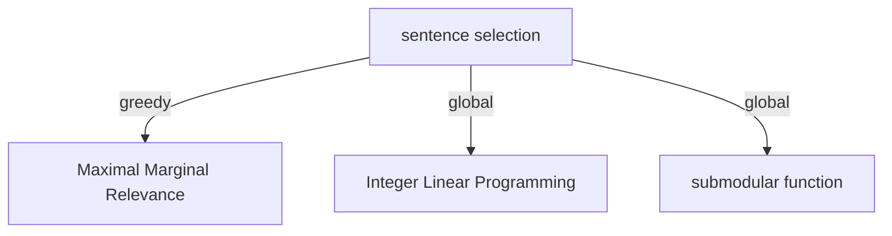

### Architecture

</img>

基本步骤： 一是对文档中的句子进行重要性计算或排序，二是选择重要的句子组合成最终摘要。

第一个步骤可采用基于规则的方法，利用句子位置或所包含的线索词来判定句子的重要性；也可采用各种机器学习方法(包括深度学习方法)，综合考虑句子的多种特征进行句子重要性的分类、回归或排序，例如 CRF, HMM, SVM, RNN等。

第二个步骤则基于上一步结果，需要考虑句子之间的相似性，避免选择重复的句子(如 MMR 算法)，并进一步对所选择的摘要句子进行连贯性排列(如自底向上法)，从而获得最终的摘要。近几年学界进一步提出了基于整数线性规划的方法以及次模函数最大化的方法，可以在句子选择的过程中同时考虑句子冗余性。

topic representation: Topic representation approaches transform the text into an intermediate representation and interpret the topic(s) discussed in the text.

indicator representation: Indicator representation approaches aim to model the representation of the text based on a set of features and use them to directly rank the sentences rather than representing the topics of the input text.

For topic representation approaches, the score is commonly related to how well a sentence expresses some of the most important topics in the document or to what extent it combines information about different topics.
For the majority of indicator representation methods, the weight of each sentence is determined by combining the evidence from the different indicators, most commonly by using machine learning techniques to discover indicator weights.

#### Integer linear programming (整数线性规划)

#### submodular function (次模函数)

Submodular functions naturally model notions of coverage, information, representation and diversity. Moreover, several important combinatorial optimization problems occur as special instances of submodular optimization. For example:  The set cover problem is a special case of submodular optimization, since the set cover function is submodular.  The facility location problem is a special case of submodular functions. The Facility Location function also naturally models coverage and diversity.  The determinantal point process model diversity.  The Maximum-Marginal-Relevance procedure can also be seen as an instance of submodular optimization.  All these important models encouraging coverage, diversity and information are all submodular. 

设计次模函数，然后利用贪心算法进行内容选取。

